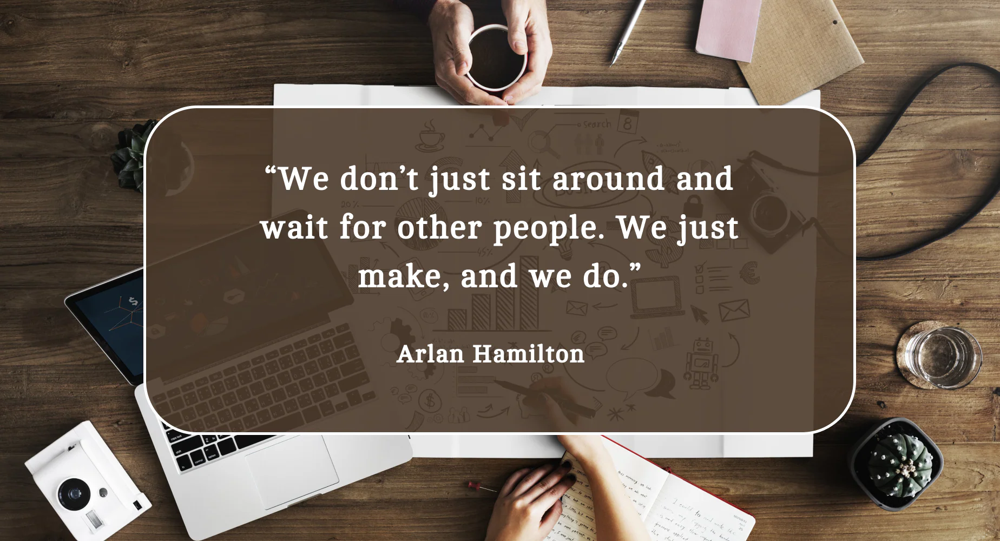

# Hey there 👋, I'm **Ramesh!**

🚀 **I'm an Entry-Level MERN Stack Developer** passionate about building modern, scalable full-stack applications.

I love turning complex ideas into functional products using **React, Node.js, Express, and MongoDB**.

---

## 🌟 **Glad to see you here!**

I'm a **MERN Stack Developer**, focused on building clean, scalable, and efficient web applications.

**My journey involves:**

- 🔐 Implementing **JWT Authentication**, **Email OTP verification**
- 🎨 Crafting modern UIs using **React, Tailwind CSS**
- 🧩 Writing clean, modular, scalable code
- 🌐 Working with **REST APIs, Redux Toolkit, Axios**
- ⚙️ Exploring backend architecture & performance improvements

As a fresher, I’ve built multiple full-stack projects following real-world industry patterns —  
including **MERN E-Commerce**, **Task Manager**, and **E-Library systems**.

---

# ✨ **Random Dev Quote**

  

---

# 🔥 **Tech Stack — MERN Focused**

  

---

# 🚀 **My Projects**

### 🔹 **Mobile Mania Store (MERN E-Commerce)**  
🔗 Live: https://mobile-mania-store.netlify.app/  
🔗 Repo: https://github.com/rameshmuthu-dev/mobilemania-mern-ecommerce  

### 🔹 **Task Manager App (MERN)**  
🔗 Live: https://taskmanager-rm.netlify.app/

### 🔹 **E-Library Management System (React + Tailwind)**  
🔗 Live: https://rameshmuthu-dev.github.io/e-library-management-system/

---

# 🤝 **Connect With Me**

  
  
  

---

### ⭐ If you like my work, consider giving a star to the repositories!
